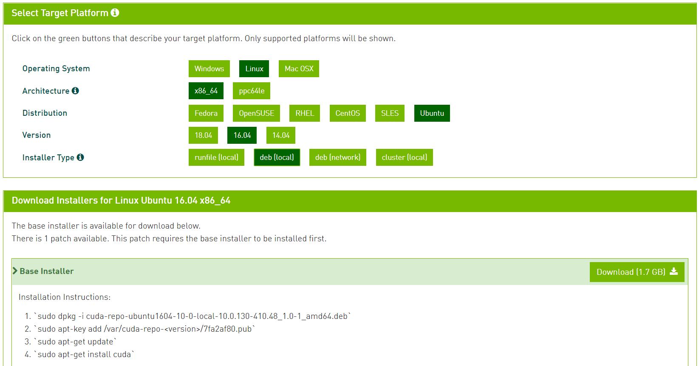

# GPU setting 방법 
[세욱 guide](https://docs.google.com/document/d/1vLYF9af7_VTs4RBzEhbzpAEofuTNHjTgIF5yIIiqyZY/edit#)

[연구실 guide](http://kdd.snu.ac.kr/wiki/index.php/GUIDE:GPU)


### 상식

GPU를 돌리기에 앞서 나의 gpu 머신이 어떤 graphic driver와 호환되는지 알아야한다. 

graphic driver는 cuda기반 programming으로 돌아가기 때문에, graph driver와 호환이 맞는 cuda, cudnn 등을 깔아야하며, tensorflow-gpu역시 호환이 맞아야한다.

다음과 같이 구글에 검색하여 참조한다. []

```shell
# google search keyword 
tensorflow source build
```


# Install CUDA 

다음과 같이 다운로드 받고싶은 cuda version을 검색한다. [검색 결과](https://developer.nvidia.com/cuda-10.0-download-archive)

```shell
# google search keyword
cuda toolkit 10.0
```
다음과 같이  머신의 운영체제의 환경에 맞는 선택을 한다.


`deb(local)` 을 선택하고,  installation Instructions를 따라 설치한다. 

```shell
# 설치 예시 
# prerequsite: download 받은 폴더로 가야한다.
$ sudo dpkg -i cuda-repo-ubuntu1604-10-0-local-10.0.130-410.48_1.0-1_amd64.deb
# Instruction에서 <version>을 대체한 부분으로 /var/[tab] 을 통해 확인후 복사 붙여넣기.
$ sudo apt-key add /var/cuda-repo-10-0-local-10.0.130-410.48/7fa2af80.pub
$ sudo apt-get update
$ sudo apt-get install cuda
# 설치후 확인
$ nvcc --version 
```

CUDA를 설치하면서 CUDA 버전에 맞는 NVIDIA Driver가 기존 드라이버에서 업그레이드 될 수 있는데,  

업데이트된 Driver를 다음과 같이 확인 할 수 있다.

```shell
# 만약 잘 작동하지 않는다면, reboot를 먼저 해보자!
# (384 -> 410 으로 업데이트 될때 reboot를 해야 바뀌었었다.)
$ nivida-smi
```


## Install multiple CUDA version

cuda version을 여러개 설치해 놓고,  필요할 떄마다 바꾸고 싶은 경우, 다음과 같은 방식으로 설치한다.

<font color=red>`Warnning:` </font> NVIDIA Driver는 CUDA를 설치하면서 업데이트 될 수 있으므로 조심. 

일단 기존에 설치되어 있는 CUDA는 내버려둔 상태에서 설치를 진행한다.

```shell
# 받고싶은 CUDA toolkit version 검색하여 설치
# google search keyword
cuda toolkit 9.0
```

앞전에 설치했던 방식과 동일하게 머신의 환경에 맞는 CUDA를 설치한다.

<font color=red> 중요:</font> 설치 후,  환경 PATH를 잘 설정 해 주어야 원하는 CUDA를 선택적으로 사용 할 수 있다.

```shell
# 환경 변수를 편집하기 위해 bashrc 폴더에 접근
$ gedit ~/.bashrc
...
######################################################################################
# ./bashrc 파일 내부
######################################################################################
# alias를 설정하므로서, 원하는 cuda를 설정할 수 있게 된다.
alias cuda9='export PATH=/usr/local/cuda-9.0/bin${PATH:+:${PATH}} \
export LD_LIBRARY_PATH=/usr/local/cuda-9.0/lib64${LD_LIBRARY_PATH:+:${LD_LIBRARY_PATH}}'
alias cuda10='export PATH=/usr/local/cuda-10.0/bin${PATH:+:${PATH}} \
export LD_LIBRARY_PATH=/usr/local/cuda-10.0/lib64${LD_LIBRARY_PATH:+:${LD_LIBRARY_PATH}}'
######################################################################################
# 저장 후, gedit을 종료후에 실행
$ source ~/.bashrc
```

`alias` 명령어를 통해 alias가 잘 설정되어있나 확인을 한다.

`nvcc --version` 명령어를 통해 현재 path로 잡혀있는 cuda의 version을 확인한다. 

```shell
# cuda 9.0을 쓰고 싶은 경우, 
$ cuda9
# cuda 10.0을 쓰고 싶은 경우, 
$ cuda10
```


# Install NVIDA Driver

[NVIDA Driver](https://www.nvidia.com/Download/index.aspx) 에서 수동으로 다운로드 받을 수 있다.